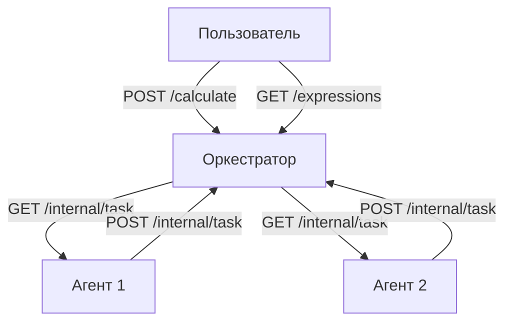

# Arithmetic-expression-calculation-service2

Система для параллельного вычисления сложных арифметических выражений с использованием оркестратора и агентов-вычислителей.

## Установка и настройка

1. **Клонируйте репозиторий**:
    ```bash
    git clone https://github.com/nikpet14321/Arithmetic-expression-calculation-service2
    cd calc_go
    ```

2. **Убедитесь, что установлен Go 1.20+**:
    ```bash
    go version
    ```
    Если Go не установлен:
    - **Linux/macOS**: [Официальная инструкция](https://go.dev/doc/install)
    - **Windows**: [Скачайте установщик](https://go.dev/dl/)

---

## Архитектура



**Оркестратор** (порт 8080 по умолчанию):

- Принимает выражения через REST API
- Разбивает выражения на атомарные задачи
- Управляет очередью задач
- Собирает результаты
- Хранит статусы вычислений

**Агенты**:

- Получают задачи через HTTP-запросы
- Выполняют арифметические операции с задержкой
- Возвращают результаты через API

## Требования

- Go 1.20+
- Поддерживаемые операции: `+`, `-`, `*`, `/`
- Приоритет операций и скобки
- Параллельное выполнение операций

# Запуск системы

## 1. Запуск оркестратора

### Linux / macOS (bash)
~~~bash
# Установка времени операций (в миллисекундах)
export TIME_ADDITION_MS=200
export TIME_SUBTRACTION_MS=200
export TIME_MULTIPLICATIONS_MS=300
export TIME_DIVISIONS_MS=400

# Запуск оркестратора
go run ./cmd/orchestrator/main.go
~~~

### Windows (cmd.exe)
~~~bat
:: Установка времени операций (в миллисекундах)
set TIME_ADDITION_MS=200
set TIME_SUBTRACTION_MS=200
set TIME_MULTIPLICATIONS_MS=300
set TIME_DIVISIONS_MS=400

:: Запуск оркестратора
go run .\cmd\orchestrator\main.go
~~~

### Windows (PowerShell)
~~~powershell
# Установка времени операций (в миллисекундах)
$env:TIME_ADDITION_MS = "200"
$env:TIME_SUBTRACTION_MS = "200"
$env:TIME_MULTIPLICATIONS_MS = "300"
$env:TIME_DIVISIONS_MS = "400"

# Запуск оркестратора
go run .\cmd\orchestrator\main.go
~~~

## 2. Запуск агента

### Linux / macOS (bash)
~~~bash
# Указание вычислительной мощности (количество горутин) и URL оркестратора
export COMPUTING_POWER=4
export ORCHESTRATOR_URL=http://localhost:8080

# Запуск агента
go run ./cmd/agent/main.go
~~~

### Windows (cmd.exe)
~~~bat
:: Указание вычислительной мощности (количество горутин) и URL оркестратора
set COMPUTING_POWER=4
set ORCHESTRATOR_URL=http://localhost:8080

:: Запуск агента
go run .\cmd\agent\main.go
~~~

### Windows (PowerShell)
~~~powershell
# Указание вычислительной мощности (количество горутин) и URL оркестратора
$env:COMPUTING_POWER = "4"
$env:ORCHESTRATOR_URL = "http://localhost:8080"

# Запуск агента
go run .\cmd\agent\main.go
~~~

## Дополнительно: Запуск в Docker

### Dockerfile для оркестратора (Dockerfile.orchestrator)
~~~dockerfile
FROM golang:1.20-alpine AS builder
WORKDIR /app
COPY go.mod go.sum ./
RUN go mod download
COPY . .
RUN go build -o orchestrator ./cmd/orchestrator

FROM alpine:latest
WORKDIR /app
COPY --from=builder /app/orchestrator .
ENV TIME_ADDITION_MS=200 \
    TIME_SUBTRACTION_MS=200 \
    TIME_MULTIPLICATIONS_MS=300 \
    TIME_DIVISIONS_MS=400
EXPOSE 8080
ENTRYPOINT ["./orchestrator"]
~~~

### Dockerfile для агента (Dockerfile.agent)
~~~dockerfile
FROM golang:1.20-alpine AS builder
WORKDIR /app
COPY go.mod go.sum ./
RUN go mod download
COPY . .
RUN go build -o agent ./cmd/agent

FROM alpine:latest
WORKDIR /app
COPY --from=builder /app/agent .
ENV COMPUTING_POWER=4 \
    ORCHESTRATOR_URL=http://orchestrator:8080
ENTRYPOINT ["./agent"]
~~~

### docker-compose.yml
~~~yaml
version: "3.8"
services:
  orchestrator:
    build:
      context: .
      dockerfile: Dockerfile.orchestrator
    ports:
      - "8080:8080"
    environment:
      - TIME_ADDITION_MS=200
      - TIME_SUBTRACTION_MS=200
      - TIME_MULTIPLICATIONS_MS=300
      - TIME_DIVISIONS_MS=400
  agent:
    build:
      context: .
      dockerfile: Dockerfile.agent
    depends_on:
      - orchestrator
    environment:
      - COMPUTING_POWER=4
      - ORCHESTRATOR_URL=http://orchestrator:8080
~~~

### .dockerignore
~~~bash
.git
node_modules
*.log
bin/
vendor/
~~~

Запуск через Docker Compose:
~~~bash
docker-compose up --build
~~~

## API Endpoints

### 1. Добавление выражения

```bash
POST /api/v1/calculate
```

Пример запроса:

```bash
curl --location 'http://localhost:8080/api/v1/calculate' \
--header 'Content-Type: application/json' \
--data '{
  "expression": "(2+3)*4-10/2"
}'
```

Успешный ответ (201):

```json
{
    "id": "1"
}
```

### 2. Получение списка выражений

```bash
GET /api/v1/expressions
```

Пример ответа (200):

```json
{
    "expressions": [
        {
            "id": "1",
            "expression": "(2+3)*4-10/2",
            "status": "completed",
            "result": 15
        },
        {
            "id": "2",
            "expression": "8/(4-4)",
            "status": "error",
            "result": null
        }
    ]
}
```

### 3. Получение выражения по ID

```bash
GET /api/v1/expressions/{id}
```

Пример запроса:

```bash
curl http://localhost:8080/api/v1/expressions/1
```

Ответ (200):

```json
{
    "expression": {
        "id": "1",
        "status": "completed",
        "result": 15
    }
}
```

## Внутреннее API (для агентов)

### 1. Получение задачи

```bash
GET /internal/task
```

Пример ответа (200):

```json
{
    "task": {
        "id": "5",
        "arg1": 2,
        "arg2": 3,
        "operation": "+",
        "operation_time": 200
    }
}
```

### 2. Отправка результата

```bash
POST /internal/task
```

Пример запроса:

```json
{
  "id": "5",
  "result": 5
}
```

## Переменные окружения

### Оркестратор

- `PORT` - порт сервера (по умолчанию 8080)
- `TIME_ADDITION_MS` - время сложения (мс)
- `TIME_SUBTRACTION_MS` - время вычитания (мс)
- `TIME_MULTIPLICATIONS_MS` - время умножения (мс)
- `TIME_DIVISIONS_MS` - время деления (мс)

### Агент

- `ORCHESTRATOR_URL` - URL оркестратора
- `COMPUTING_POWER` - количество параллельных задач

## Примеры сценариев

### Сценарий 1: Успешное вычисление

```bash
# Отправка выражения
curl --location 'http://localhost:8080/api/v1/calculate' \
--data '{"expression": "2+2*2"}'

# Проверка статуса
curl http://localhost:8080/api/v1/expressions/1

# Ответ через 500 мс:
{
    "expression": {
        "id": "1",
        "status": "completed",
        "result": 6
    }
}
```

### Сценарий 2: Ошибка деления на ноль

```bash
curl --location 'http://localhost:8080/api/v1/calculate' \
--data '{"expression": "10/(5-5)"}'

# Ответ:
{
    "expression": {
        "id": "2",
        "status": "error",
        "result": null
    }
}
```

## Тестирование

```bash
go test .\tests\
```
